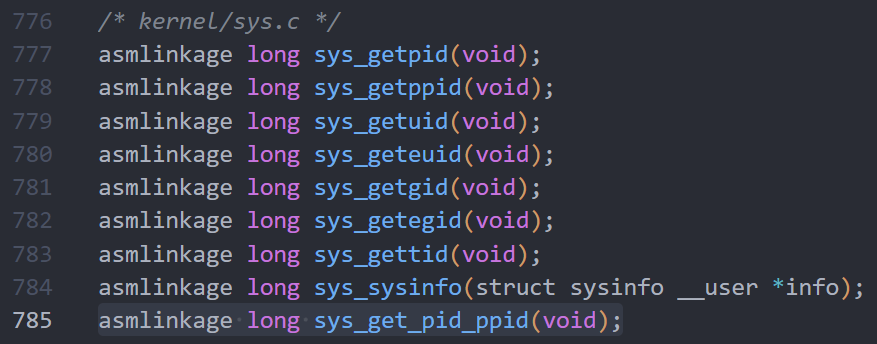
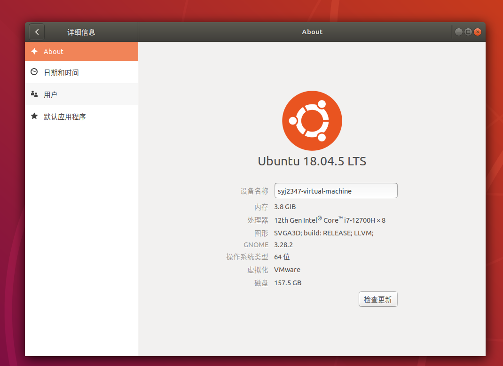
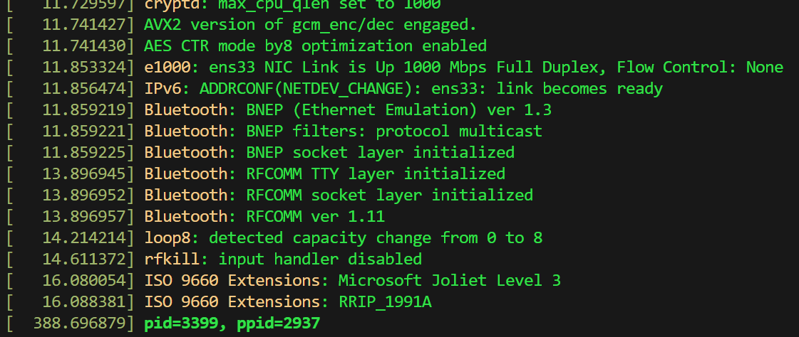

## 安装

- 首先下载linux内核，放入$usr/src$中解压后进入，分别修改几个文件
- 需要下载一些依赖：

```sh
sudo apt-get install libncurses5-dev  
sudo apt install build-essential	 
sudo apt-get install flex		 
sudo apt-get install bison 
sudo apt-get install dwarves
sudo apt-get install libelf-dev
...
```

- 我的需求是输出当前进程的 $pid$ 和$ppid$
- $kernel/sys.c$

```c
SYSCALL_DEFINE0(get_pid_ppid) {
    printk("pid=%d, ppid=%d\n", task_pid_nr(current), task_tgid_nr(current->real_parent));
    return 0;
}
```

- $include/linux/syscalls.h$

```c
asmlinkage long sys_get_pid_ppid(void);
```



- $arch/x86/entry/syscalls/syscall\_{}64.tbl$

```c
335     64      get_pid_ppid            sys_get_pid_ppid
```


- 修改完执行以下内容：

```sh
sudo make clean
sudo make mrproper 
(前两条指令均为清理之前编译错误的无用文件，第一次可以不需要，重新编译加上)
sudo make menuconfig
(生成配置文件，记得全屏，否则可能报错，进入后直接exit即可)
```

- 修改.config

```sh
sudo vim .config
```

- 将`CONFIG_SYSTEM_TRUSTED_KEYS` `CONFIG_MODULE_SIG_ALL`  `CONFIG_DEBUG_INFO` 注释

```sh
sudo make -j6(查看当前的CPU核数，6代表用6个CPU,写多没关系)
sudo make modules_install
sudo make install
sudo reboot(重启)
```

- 第一次编译时显示存储空间用完，且无法重启虚拟机（这时才意识到快照的重要性，幸运的是之前有拍摄快照，但不幸的是时间比较早，恢复到快照后个性化配置几乎没了……）
- 只能重新安装虚拟机（包括装vmtool，配置下载源，ssh连接等等繁杂过程），并分配更大的硬盘空间



<br/>

- 重新一遍，终于成功


- 重启虚拟机

## 测试

- 重启后，查看内核版本是否更新

```sh
sudo uname -r
```


- 编写函数调用系统调用进行测试

```c
#define _GUN_SOURCE
#include <unistd.h>
#include <sys/syscall.h>
int main()
{
    syscall(335);
}
```

```sh
 vim test.c
 gcc test.c -o test
 ./test
 dmesg
```

- 输出结果如下：


